## ⌨️ My Stacks
  

    
    
    
    
    
    
    
    
    
    
  

## 🖥️ What I use

  
  

## 📖 What am I studying
  

    
    
    
  

  
## ✏️ Experiences
 - 충북대학교 컴퓨터공학과 ` (2021.02 ~) `
 - 제 12회 K-Hackathon 참여 ` (2024.05 ~ 2024.07) `
 - 충북대학교 IT동아리 CaTs 임원 `(2025.02 ~ 2025.12) `

## ☎️ How to Contact
</a>

## 📊 Statistics

